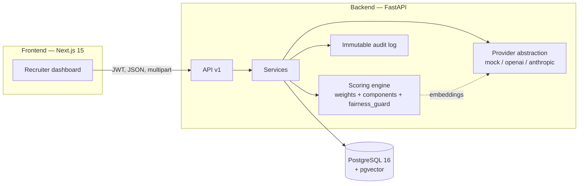

# TalentTrust AI

**An AI recruiter copilot that turns a CV + a job vacancy into a verifiable, explainable
candidate dossier — with deterministic scoring and human-owned final decisions.**

> Not a background-check tool. TalentTrust AI sits *before* formal background screening: it
> organizes candidates, analyzes evidence, flags inconsistencies in neutral language, suggests
> interview questions, and records an auditable human decision — keeping the recommendation
> non-binding and the final call with a person.

[](https://github.com/USER/talenttrust-ai/actions/workflows/ci.yml)

---

## The problem

Recruiters at startups, SMBs and LatAm consultancies triage many CVs by hand — cross-checking the
CV against the vacancy, judging seniority, spotting gaps and inconsistencies — without a consistent
criterion, without traceability, and without an expensive ATS. AI hiring tools, meanwhile, are under
growing scrutiny for opaque, black-box scoring and bias.

## The solution

A copilot that, **for one candidate against one structured vacancy**, produces:

- a **deterministic 0–100 fit score** with a fully **explainable breakdown** (six fixed-weight factors),
- a professional **summary**, **skills with evidence**, **gaps**, neutral **inconsistencies**, and
  suggested **interview questions** — every conclusion cites its source (CV / vacancy / score / rule),
- a **non-binding recommendation**, and a **human-recorded final decision** with full audit trail,
- a shareable **PDF** export.

The number is computed by deterministic rules + embeddings and is **reproducible**; the LLM only
*explains* it and never changes it. A **fairness guard** strips sensitive attributes (age, gender,
nationality, marital status, health, religion, politics, exact address, photo, family) before scoring.

## 1-minute demo flow

```
Login → Create a vacancy → Upload a candidate CV (with consent)
      → Generate dossier (score + breakdown + evidence + gaps + inconsistencies + questions)
      → Record the human decision (interview / review / reject / hold)
      → Export the dossier as PDF
```

Run it end-to-end with one command (backend must be up): `./scripts/smoke_e2e.sh`.

## MVP features

| Area | What it does |
|------|--------------|
| Multi-tenant auth | JWT (access + refresh), org-scoped, roles `org_admin` / `recruiter` / `viewer` |
| Vacancies | Create / list / detail, validated, organization-isolated |
| CV ingestion | PDF/DOCX (≤5 MB, text-extractable) → parsed profile (ES + EN), consent captured & versioned |
| Deterministic scoring | 0–100, six fixed factors (35/20/15/10/10/10), reproducible, breakdown reconciles to the total |
| Explainable dossier | Summary, skills-with-evidence, gaps, neutral inconsistencies, interview questions |
| Fairness guard | Sensitive attributes never reach the scoring engine |
| Human-in-the-loop | Non-binding AI recommendation; the final decision is recorded by a human |
| Immutable audit log | `cv_parsed`, `score_computed`, `dossier_generated`, `decision_recorded`, `pdf_exported`, `candidate_deleted`, login events |
| Privacy | On-demand hard delete + configurable TTL; PII-free deletion audit |
| PDF export | ReportLab dossier with score, evidence, decision and a legal note |

## Architecture



**Pipeline:** `CV (PDF/DOCX) → cv_parser → fairness_guard → scoring (deterministic) → inconsistency_detector → interview_questions → dossier → human decision → PDF`. The LLM is used only for the
narrative/summary and never for the numeric score.

## Tech stack

- **Backend:** Python 3.11, FastAPI, SQLAlchemy 2.0 (async), Pydantic v2, Alembic, PostgreSQL 16 +
  pgvector, Celery/Redis (scaffolded), PyMuPDF + python-docx (CV parsing), ReportLab (PDF), pytest.
- **Frontend:** Next.js 15 (App Router), TypeScript, Tailwind v4, ESLint.
- **AI providers:** behind interfaces — deterministic **mock** by default (offline, used in CI),
  OpenAI / Anthropic adapters available. **No real LLM calls in tests/CI.**

## Screenshots

Placeholders to capture — see [`docs/screenshots/README.md`](docs/screenshots/README.md):
login · vacancies list · vacancy detail (CV upload) · candidate dossier · score breakdown ·
human decision · PDF export.

## Quickstart (Docker Compose)

```bash
cd backend
cp .env.example .env
docker compose up --build   # from repo root: postgres+pgvector, redis, backend
```

The backend runs migrations on startup and serves OpenAPI docs at http://localhost:8000/docs.

Create an org + org_admin to log in with:

```bash
curl -s localhost:8000/api/v1/auth/register -H 'content-type: application/json' \
  -d '{"organization_name":"Acme","email":"admin@acme.com","password":"supersecret1"}'
```

Full step-by-step (incl. frontend, CV upload, dossier, decision, PDF): see
[`docs/quickstart.md`](docs/quickstart.md).

### Run the backend (without Docker)

```bash
cd backend
python3.11 -m venv .venv && . .venv/bin/activate
pip install ".[dev]"
# Postgres + pgvector required for migrations; then:
alembic upgrade head
uvicorn app.main:app --reload
```

### Run the frontend

```bash
cd frontend
cp .env.local.example .env.local   # NEXT_PUBLIC_API_URL=http://localhost:8000
npm install
npm run dev                        # http://localhost:3000
```

### Run the tests

```bash
cd backend && LLM_PROVIDER=mock EMBEDDING_PROVIDER=mock pytest -q   # 97 tests, offline
ruff check app tests && mypy app

cd frontend && npm run typecheck && npm run lint && npm run build
```

### Run the end-to-end smoke

```bash
# with the backend running on localhost:8000 (mock providers):
BASE=http://localhost:8000 ./scripts/smoke_e2e.sh
# → register → login → vacancy → CV upload → dossier → score → decision → PDF; "SMOKE E2E PASSED"
```

See [`docs/smoke-e2e.md`](docs/smoke-e2e.md) for expected outputs.

## Key technical decisions

- **Deterministic score, LLM explains only.** The 0–100 value comes from fixed-weight rules +
  embeddings; the LLM writes prose around it. A test asserts identical inputs → identical score,
  and that swapping the LLM provider never changes the number.
- **Evidence-based by construction.** Every dossier conclusion carries an evidence reference; the
  service drops any unsourced item (no fabricated conclusions).
- **Fairness by construction.** The scorer consumes an allowlist of non-sensitive signals; sensitive
  CV lines are stripped first — a test proves mutating a sensitive attribute leaves the score unchanged.
- **Providers behind interfaces.** Mock default keeps CI free, fast and fully offline.
- **Spec-driven.** Built with Spec Kit: constitution → spec → clarify → plan → tasks → analyze →
  implement (see [`specs/001-talenttrust-mvp/`](specs/001-talenttrust-mvp/)).

## Known limitations

- **No persistent "list candidates per vacancy" endpoint** yet — the UI lists only candidates
  uploaded in the current session (links to each candidate page persist by URL).
- **Auth tokens in `localStorage`** (simple MVP approach; no auto-refresh / httpOnly cookies yet).
- **`candidate_email`** is captured in the UI but not persisted (the Phase-1 upload contract has no
  email field) — informational only.
- **Celery worker is scaffolded but not wired**: CV analysis runs synchronously. Async execution is
  a planned improvement.
- **Mock providers by default** in CI; real OpenAI/Anthropic require keys and are never used in tests.
- **No OCR**: image-only/scanned PDFs are rejected (text-extractable PDF/DOCX only).

## Roadmap (V2)

Public-profile enrichment (GitHub/LinkedIn) with an evidence graph · candidate consent portal ·
sensitive-verification gate + background-check provider integration · mass candidate ranking ·
async analysis via Celery · ATS integrations · billing/teams.

## What this project demonstrates

- A **production-shaped FastAPI backend**: async SQLAlchemy, Alembic migrations, multi-tenant RBAC,
  immutable audit logging, dependency-injected services, and 97 deterministic offline tests.
- **Applied AI done responsibly**: a hybrid (deterministic + embeddings + LLM-for-explanation)
  scoring engine that is reproducible, explainable, fairness-aware and human-in-the-loop by design.
- **Full-stack delivery**: a typed Next.js frontend consuming the API end-to-end, with a documented
  one-command smoke test.
- **Spec-driven, principled engineering**: a written constitution and traceable spec→plan→tasks.

## Why this matters for Python Backend / Applied AI roles

It shows I can ship an AI feature that a company can actually defend: the score is **auditable and
reproducible** (no black box), sensitive attributes are **provably excluded** from scoring, every
claim is **sourced**, and a **human owns the decision** — exactly the properties regulated, bias-
sensitive hiring workflows demand. It also shows the unglamorous fundamentals: clean layering,
migrations, RBAC, audit trails, deterministic CI, and tests that encode the guarantees rather than
just the happy path.

---

Backend details: [`backend/README.md`](backend/README.md) · Frontend details:
[`frontend/README.md`](frontend/README.md) · Constitution & specs:
[`specs/001-talenttrust-mvp/`](specs/001-talenttrust-mvp/).
